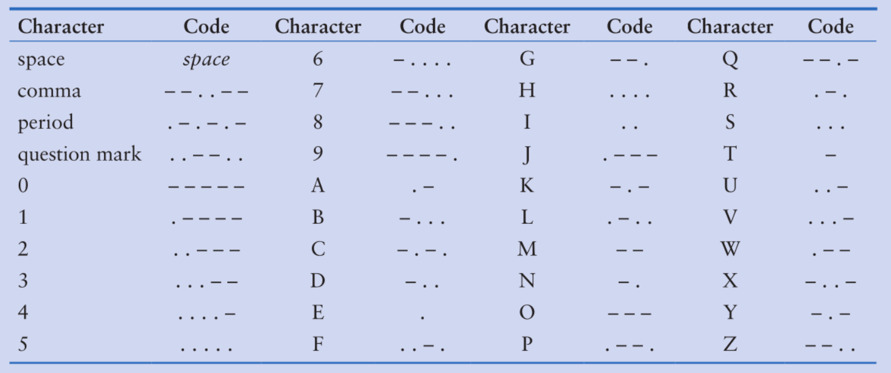

# Objectives

- Look more closely at basic string operations, such as iterating
  over string characters and accessing them.
- Understand how strings are immutable.
- Reinforce some ideas about how to concatenate and repeat strings using
  operators `+` and `*` on Python strings.
- Practice more with some advanced notions of perform slicing on Python
  strings.
- Become familiar with string member methods for testing strings, 
  modifying strings and searching in strings
- Use more advanced string methods to perform text processing tasks,
  like tokenization.

# Description

This assignment consists of 3 to 4 questions that cover topics from
chapter 8 (More About Strings) of our course textbook.

Python provides several ways to access the individual characters in a
string. Strings also have methods that allow you to perform operations
on them. There are many types of programs that not only read strings as
input and write strings as output, but also perform operations on
strings. Word processing programs, for example, manipulate large amounts
of text, and thus work extensively with strings. Email programs and
search engines are other examples of programs that perform operations on
strings.

In this assignment you will learn more about using and manipulating
string objects using the Python language to perform more advanced
text processing tasks in application programs.


## Assignment Prerequisites and Setup

Before performing any assignment in this class, you need to have
the following tasks already completed.

1. You need to have `git` tools installed on your system so that you
   can successfully clone repositories and create commits.
2. You need to have a GitHub account created.
   - You need to have successfully created a ssh key so that you can
     authenticate with and push commits back to git.
3. You need a working Python 3 distribution installed on the system you
   will work on these assignments with, that you can run Python scripts
   and the Python IDLE interface within.

See our class 
[Getting Started with Python and Git for Class Assignments](https://github.com/etamu-class/python-git)
for links on setting up these needed development environment tools and configuration.


# Assignment Questions

Start by cloning the assignment repository that was created for
you when you accepted the assignment.  There are 4 mostly empty
Python script files in the top level of this assignment named
`q01.py` through `q04.py`.

You should answer each of the following questions by writing appropriate
Python code to solve the stated task.  Once you are satisfied with
your answer, you should create a commit and push it back to your
GitHub repository for grading.  In general you should do each
question as a separate commit 
(see [Git Best Practices](https://gist.github.com/luismts/495d982e8c5b1a0ced4a57cf3d93cf60)).

Each commit you push to GitHub will create a release that will be
graded.  Look at the `Releases` on the right hand side of your `Code`
page to see a summary of your grade results.  Also the instructor
will give feedback for all assignments in your `Feedback` Pull request.
See the `Feedback` pull request listed on GitHub on the `Pull requests`
tab.

You can and should test your code locally before creating commits
and submitting it to GitHub.  As mentioned, since you are now writing
functions for your assignments, we are now using the `pytest` unit
testing module in your autograder and to run tests against your work.
So for example, to run the tests for question 01, from the command line you
can do:

```bash
$ python3 -m pytest -v -s test/test_q01.py
========================== test session starts ===========================
platform linux -- Python 3.14.6, pytest-9.1.1, pluggy-1.6.0 -- /opt/base/bin/python3
cachedir: .pytest_cache
rootdir: /workspaces/assg03-solution
collected 8 items                                                                                                          

test/test_q01.py::test_freezing PASSED
test/test_q01.py::test_boiling PASSED
test/test_q01.py::test_intersection PASSED
test/test_q01.py::test_room_temperature_1 PASSED
test/test_q01.py::test_room_temperature_2 PASSED
test/test_q01.py::test_body_temperature PASSED
test/test_q01.py::test_zero PASSED
test/test_q01.py::test_one_hundred PASSED

=========================== 8 passed in 0.01s ============================
```

There should be tests for each question in the `test` subdirectory,
named `test_q01.py`, `test_q02.py`, etc. for our class assignments.
These will be (some of) the same `pytest` tests that are run by the autograder
when you submit your work.

For the applications that your write in questions for an assignment,
we are also still using the simple input / output diff comparison to
test.  These are invoked as part of the `pytest` tests of these questions.
But as usual, when you are writing the applications, you can look for the
expected output in the `test/data` subdirectory, to see exactly
what your prompts and output should be formatted to look like in order
to pass your tests.  For example, if you run the tests for a question
03 application (and you have them passing), you should see:

```bash
$ python3 -m pytest -v -s test/test_q03.py
============================= test session starts ==============================
platform linux -- Python 3.14.6, pytest-9.1.1, pluggy-1.6.0 -- /opt/base/bin/python3
cachedir: .pytest_cache
rootdir: /workspaces/assg03-solution
collected 5 items                                                                                                                                              

test/test_q03.py::test_small_loan PASSED
test/test_q03.py::test_medium_loan PASSED
test/test_q03.py::test_large_loan PASSED
test/test_q03.py::test_zero_interest PASSED
test/test_q03.py::test_q03_application 
Question <q03_application> Test 01:  PASSED 
Question <q03_application> Test 02:  PASSED 
Question <q03_application> Test 03:  PASSED 
Question <q03_application> Test 04:  PASSED 

 =========================================================================== 
 All attempted question tests passed  (004 passed of 004 tests attempted)
PASSED

============================== 5 passed in 0.10s ==============================

```

Here the `q03_application` tests are being invoked by the `pytest` module,
but you can still run these by hand if you wish:

```bash
$ python3 test/test-question.py -c q03_application.py

Question <q03_application> Test 01:  PASSED 
Question <q03_application> Test 02:  PASSED 
Question <q03_application> Test 03:  PASSED 
Question <q03_application> Test 04:  PASSED 

 =========================================================================== 
 All attempted question tests passed  (004 passed of 004 tests attempted)
```


## Question 1: Date Conversion (7 points)

Write a function named `convert_date_format()` in the `q01.py` file
for this assignment.  This function will take a
string in the format “mm/dd/yyyy”, for example “03/12/2018”.  The
function should create and return a new string in the format “March 12,
2018” as an example of converting the input string into the new format.

**Note**: the function is not expected to enforce 2 digit `mm` or `dd`
numbers, nor 4 digit years, so "m/d/y" is a valid input date format.

You may want to use a dictionary to define a conversion mapping between
a month number and a month name here instead of a big if/elif/else block
of code.  You are required to demonstrate the use of the `str.split()`
method in your implementation of this function.


## Question 2: Morse Code Converter (7 points)

Morse code is a code where each letter of the English alphabet, each
digit, and various punctuation characters are represented by a series of
dots and dashes.  The following table shows the Morse code encodings
you are to implement for this question.



### Question 2 Part 1: Create function to translate text to Morse code

Write a function named `text_to_morse_code()` in the given `q02.py` file
for this assignment.  This function will take a string of characters.
Assume that any ascii character can be given for translation to your
function.  You should treat any lower case alphabetic characters given
as upper case, and translate as shown in the table.  You should
translate the three punctuation characters as shown, and a space in the
input should translate as a single space in your output. Any other
character not given in the above table should be silently ignored by
your function, they will simply not be translated and represented in
your morse code.    

Your function should convert all of the characters of the input text
string into morse code encoding, and return the newly encoded morse code
string as its result.  Again you will probably find a dictionary
useful here to map from the characters to the Morse code encoding for
this question.  The tests will expect you handle lower case and unknown
characters as described above, and that your function does not cause
an exception to be thrown when used.

### Question 2 Part 2: Write an application to translate user messages to Morse code

For the second half of this question, write a simple application in the
`q02_application.py` file that prompts the user for a message to
translate to Morse code and displays the translated morse code for
a message.  The application should continue prompting the user for
more messages to translate until they enter `stop`.  See the expected
output for the question 02 application in the tests for details.


## Question 3: Character Analysis (8 points)

A commonly needed task to perform text processing is that one needs
basic information about the properties of a given text, such as the
number of characters and punctuation, the number of lines in the text,
etc.

### Question 3 Part 1: Create a function to perform character analysis

Implement a function called `character_analysis()` in the `q03.py` file
for this question.  This function will take a string of written text,
possibly with multiple lines and different types of characters in it.
It should analyze the string and return the following analysis:

- The total number of characters in the input string
- The total number of words in the input string
- The total number of lines in the input string
- The number of lower case digits that occur in the input string
- The number of upper case digits that occur in the input string
- The number of decimal digits that occur in the input string
- The number of whitespace characters that occur in the input string

Your function should determine all of these for the given input string,
and return the resulting counts as a tuple of values from your function.
You probably need to use appropriate string functions to determine if
given characters are whitespace, digits, upper or lower case, etc. here. 

**Hint**:  A line always ends in the special newline character `\n`, so you
can count the number of lines by counting the newline characters in the given
string.

**Hint**: Also usually a line without a newline at the end is considered
a single line, not a line count of 0, and even an empty string is
considered to have a line count of 0, though word count and character
count would be 0 in that case.  And in a file, often the last line will
not have a newline, or if there is a newline, the count of number of
lines is 1 larger than people might often expect...

**Hint**: You may not be able to perform all of these tasks as a single
loop, e.g. counting the number of words requires tokenization.  Assume
words are separated by standard whitespace characters.

### Question 3 Part 2: Write an application to analyze a file of text

The application should as usual be implemented in the `q03_application.py`
file and import the function you write for part one of this question.
Write a simple application that takes the name of a file, opens and
reads in the file into a string, and analyses the text of the file using
your function.  You should do basic input validation and reprompt if the
file can not be opened.  You should give your output of the analysis
of the file to match the following output (see the expected output
in the `test/data` files for more details):

```
Enter name of file to perform character analysis on: test/data/text1.txt

Analysis of file <test/data/text1.txt>
  Number of characters:    8146
  Number of words:         1337
  Number of lines:         65
  Number uppercase chars:  223
  Number lowercase chars:  6382
  Number digits:           5
  Number whitespace chars: 1369
```

## Question 4: Word Frequency Analysis (8 points)

Another common next step when performing text processing / text analysis,
after gathering basic information about a text, is to perform a 
word frequency analysis of the text.


### Question 4 Part 1: Implement a function to perform word frequency analysis

Write a function that will take a text string as input, and will return
a frequency count of all of the words in the text string.  The function
should be named `word_counts()` and be implemented in the `q04.py` file
for this question.  This function should return a dictionary, where
every word that appears in the input text will be a key of the returned
dictionary, and the value will be the total count of the number of times
that word appears in the input text.

In order to consider capitalized words as the same as uncapitalized
words, you should convert all characters into lower case when counting and
inserting them into your dictionary.  Also for this question, you should
only consider sequences of alphabetic characters as words.  This means you
should ignore all non alphabetic characters when you tokenize your string
for doing the analysis.  There are several approaches that would work for this.
You could list all possible non alphabetic characters as the separator list for
`str.split()`.  Or alternatively you might consider converting/removing all
non alphabetic characters (before or after conversion to all lower case).
In general a string like the following:

```python
"""Now is tHe time4, all good men! 2come 2the aid OF Their COUNTRY!"""
```

should result in all non alphabetic characters being removed and all characters
converted to lowercase, so the string would be tokenized as:

```python
"""now is the time all good men come the aid of their country"""
```

resulting in the following list of words once tokenized:

```python
['now', 'is', 'the', 'time', 'all', 'good', 'men', 'come', 'the', 'aid', 'of', 'their', 'country']
```

**Hint**: If  you google this you might find a lot of solutions using
the Python regular expression module `regex`, however, in terms of what
you have learned from our textbook so far in this class, an easy
approach is to simply create a new string by keeping only alphabetic and
whitespace characters, e.g. using the `str.isalpha()` and
`str.isspace()` methods, discussed in this chapter with a loop or list
comprehension.

### Question 4 Part 2: Write an application that performs both character and word frequency analysis

This application is a simple extension of the application you
implemented for question 03.  You can start by simply copying over your
implementation for the character analysis application.  However, add in
a call to your `word_counts()`, and display the word frequency of all
words after the character analysis for the input file.  As shown in the
expected output for the question 4 application, you need to sort the
output of the displayed word frequencies from the most frequent word in
the dictionary to the least frequent word.

**Hint**: Some students might find the requirement to show the word frequency
counts sorted by frequency a challenge here.  There are multiple approaches
that are possible.  A common approach would be to get all key/value pairs from
the dictionary into a list of (value, key) pairs.  Then you could sort that list, 
because if the value is a count it should sort the list of tuples by the frequency
count.  Then once sorted, you can iterate over your sorted list of (value, key)
pairs, and display the key and its word frequency.  This should all be done
in the question 04 application when displaying the word frequency analysis.


# Assignment Conclusion / Checklist

Hopefully you have created commits after completing each question and pushed
them successfully to your assignment repository.  Make sure that you
do the following for this and all class assignments.

- Check your autograder results after pushing your commits.  Look
  in your `Feedback` pull request, and in the detailed autograder
  report generated for your release(s) made for each commit.
- You should never close or merge your `Feedback` pull request, as is
  mentioned in the comment.  The instructor will evaluate your assignments,
  and may give you feedback about your code or work.  Check here after
  the assignment is returned for a code review and assignment comments.
- In general this class will ask you fo follow and use good Python
  style as specified by the official
  [Python PEP 8 Style guide](https://peps.python.org/pep-0008/).
  You should at least pay attention to
  - All indentation is required to be 4 spaces with no tabs in files.
  - Maximum line lengths should be usually observed, do not generally
    extend code past the 79 character column in a file.
  - Follow the suggestions for breaking long lines in code (e.g. line
    break before binary operators in a long expressions).
  - Prefer single quotes for all string in code for class assignments,
    unless you need a string with a single quote, for example to
    add an apostrophe 's.
  - Follow Pep8 style for whitespace in expressions and statements.  
    For example, usually a single space should go before and after
    all binary operators in expressions.
  - We encourage the use of function annotations in Python code.
- Also in general in this class we will ask you to follow
  [Git Commit Best Practices](https://gist.github.com/luismts/495d982e8c5b1a0ced4a57cf3d93cf60)
- Strive to use 
  [Meaningful Names](https://www.freecodecamp.org/news/how-to-write-better-variable-names/)
  for variables, constants and functions in your code.  You are required
  to follow Pep8 naming guidelines, which means `snake_case` names
  for variables and functions and `SCREAMING_SNAKE_CASE` for 
  constants.  Python style switches to `PascalCase` for 
  class names.

Make sure you are checking review comments and code review given
for your class assignments.  We may start by making suggestions where your
style or practices could be improved.  As the class progresses, some
of these suggestions may become requirements, especially for students who
are repeatedly making the same style or practice error and are not
following feedback to correct a noted issue in future assignments.
Assignments may be left ungraded in some cases for style or practice
issues until corrected, and/or may have points removed or receive
a 0 grade if issues continue after receiving multiple feedback that
are repeatedly ignored and not corrected.

# Additional Information

The following are suggested online materials you may use to help you understand
the tools and topics we have introduced in this assignment.

- [Python PEP 8 Style guide](https://peps.python.org/pep-0008/)
- [Git Commit Best Practices](https://gist.github.com/luismts/495d982e8c5b1a0ced4a57cf3d93cf60)
- [Git Best Practices](https://gist.github.com/pandeiro/1552496)
- [Best Practices to Write Readable and Maintainable Code: Choosing meaningful names](https://dev.to/pacheco/how-do-you-name-things-3jae)
- [How to Write Better Names for your Variables, Functions and Classes](https://www.freecodecamp.org/news/how-to-write-better-variable-names/)